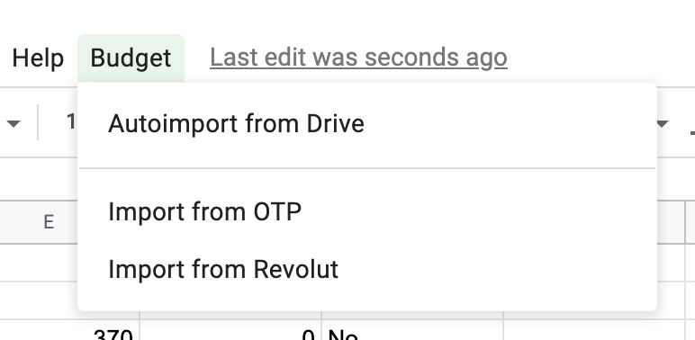
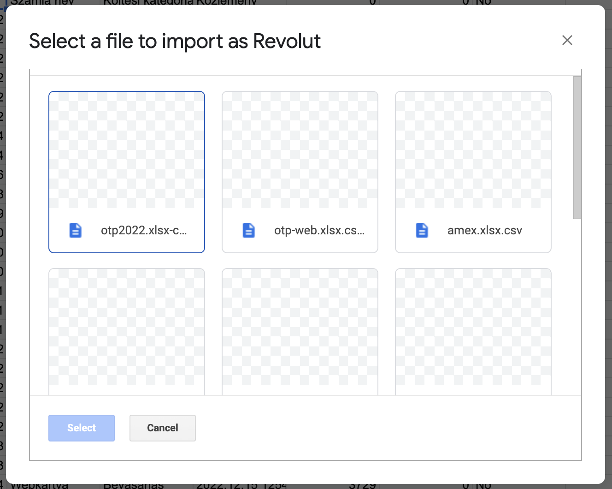

# OpenBudget

OpenBudget imports Bank statments to Google Spreadsheet easily. It's built on Google Apps Script, require developer account and it has a self-serv installation.

## What does it do?

OpenBudget creates a Spreadsheet menu item called "Budget"

Currently, it supports two providers (OTP, Revolut). By clicking on one of the import item you can browse for CSV files in your Google Drive. By selecting one it will be imported to your spreadsheet.

AutoImporter guesses Bank provider by filename (checkout `app/config.ts` for more details) and import them. Only your Google Drive root directory will be scanned and imported. Data does not shared by third party provider.

## Installation & Development

The first step is to download all the dependencies. Run `npm install`.

OpenBudget written in TypeScript, so it has to be compiled into Javascript and bundled before deploying. To build it run `npm run build`. 

For development use `npm run test` to run tests locally. Google's classes are not accesible locally, so it has to be mocked all the time.

To deploy the codebase use `npm run deploy`. Before you do so, please follow the article below to setup `clasp`on your host.
https://medium.com/geekculture/how-to-write-google-apps-script-code-locally-in-vs-code-and-deploy-it-with-clasp-9a4273e2d018

Build, test and deploy use watcher too. Any code change will be built & delivered right away. 

## Configuration

1. Open `app/config.ts` file.
2. Add your own `developerKey` there
3. Your bank is not supported yet? Create your own converter and create a pull request.

## Support another Banks

1. Open `app/config.ts` and extend your `availableConverters` list
2. Create a copy of `converter/converter-revolut.ts` and adust to your own bank account (you have to map your csv to the `Transaction` model)
3. Add your newly created file to the index: `converter/index.ts` so autoloader will find it
